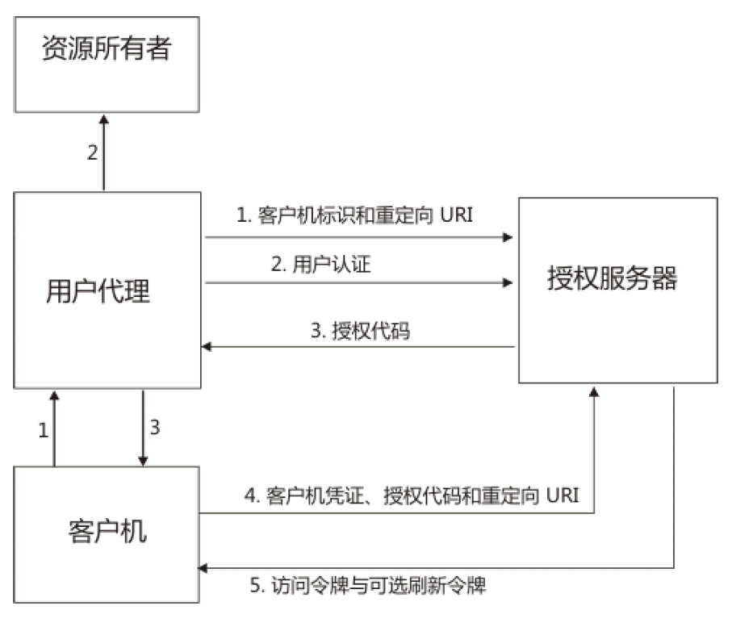
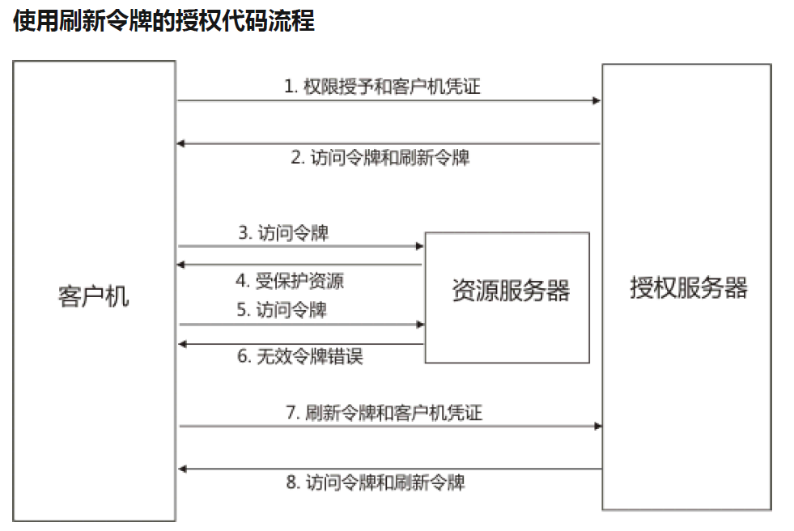
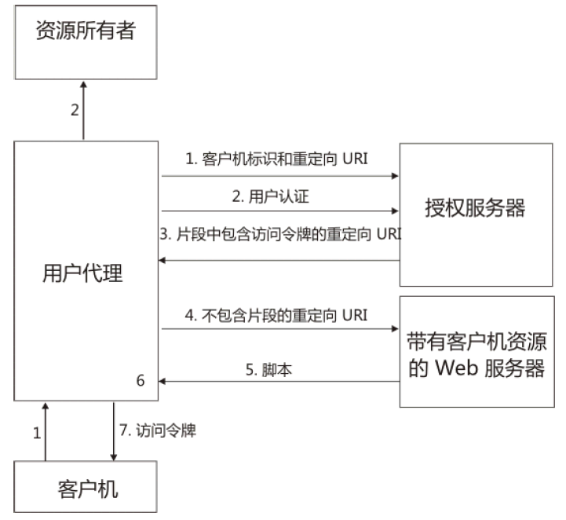
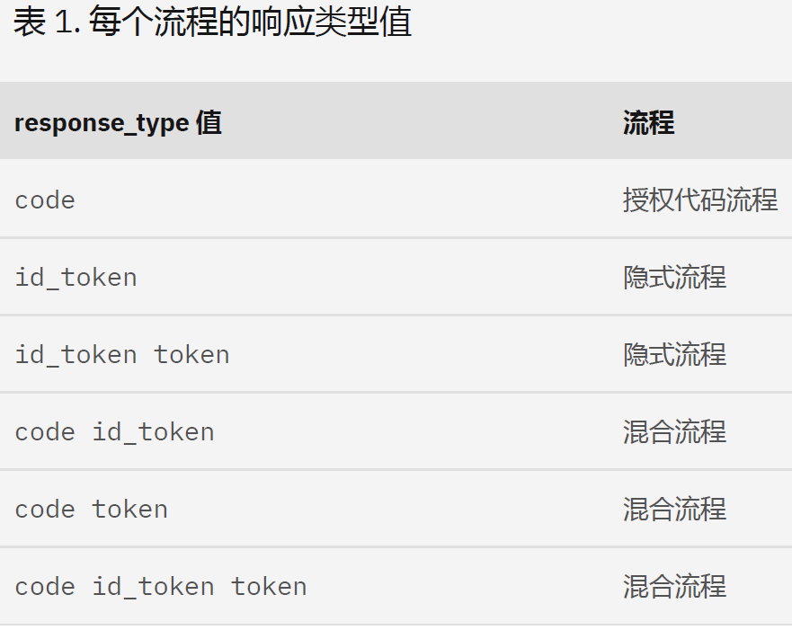
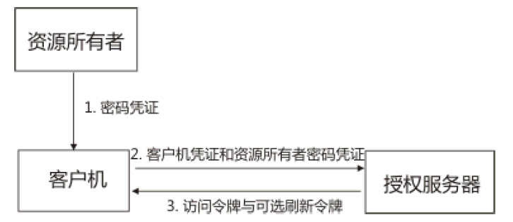
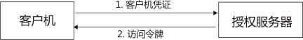

OAuth 2.0 和 OIDC 工作流程

OAuth 2.0 工作流程

OAuth 2.0认证是一个开放标准，它允许用户授权第三方应用访问他们存储在另外的服务提供者上的信息，而不需要将用户名和密码提供给第三方应用或分享他们数据的所有内容。这一机制确保了用户在使用第三方应用时，其个人数据的安全性和隐私性得到了有效保护。

OAuth 2.0是OAuth协议的延续版本，但不向后兼容OAuth 1.0，即完全废止了OAuth 1.0。OAuth 2.0关注客户端开发者的简易性，同时为Web应用、桌面应用、手机应用以及智能家居设备提供专门的认证流程。

在OAuth 2.0认证流程中，通常涉及以下几个角色：

1. 资源拥有者：通常是最终用户，他们拥有并控制受保护的资源。
2. 客户端：需要访问资源拥有者的受保护资源的第三方应用。
3. 授权服务器：验证资源拥有者的身份，并授权客户端访问受保护的资源。
4. 资源服务器：托管受保护的资源，并接受来自已授权客户端的访问请求。

通过OAuth 2.0认证，第三方应用可以获得一个令牌（token），该令牌对应于特定的第三方应用，只能在特定的时间内访问特定的资源。这种机制有效地避免了直接暴露用户名和密码，提高了系统的安全性。

总的来说，OAuth 2.0认证是一种安全、灵活的授权机制，它允许用户在使用第三方应用时，保持对其个人数据的控制和保护。

授权代码授权类型适用于那些向授权服务器进行认证时可以对其客户机凭证进行保密的 OAuth 客户机。例如，在安全服务器上实现的客户机。作为基于重定向的流程，OAuth 客户机必须能够与资源所有者的用户代理进行交互。它还必须能够通过重定向接收来自授权服务器的传入请求。

对于 OIDC，依赖方是 OAuth 客户机，OIDC 提供者是 OAuth 授权服务器。对于OIDC，授权代码流程会向依赖方返回授权代码，然后可以直接将此代码交换成标识令牌和访问令牌。此机制的优点是不会向浏览器或最终用户公开任何令牌。OpenID Connect 提供者在将授权代码交换成访问令牌之前，还会对依赖方进行认证。授权代码流程适合可以安全地维护自身与 OpenID Connect 提供者之间客户机密钥的依赖方。

### 授权代码流程

1. OAuth 客户机会在将资源所有者的用户代理定向到授权端点时启动流程。OAuth 客户机包括其客户机标识、所请求的作用域、本地状态以及重定向 URI。在准予或拒绝访问之后，授权服务器会将用户代理发回到重定向 URI。
对于 OIDC，作用域必须包含openid。另外还必须包含state参数。

2. 授权服务器通过用户代理对资源所有者进行认证，并确定资源所有者是准予还是拒绝访问请求。
3. 如果资源所有者准予访问，那么 OAuth 客户机将使用先前提供的重定向 URI 将用户代理重定向回 OAuth客户机。重定向 URI 包括授权代码以及 OAuth 客户机先前提供的所有本地状态。
如果此为 OpenID Connect 请求，那么重定向 URI 必须存在。而对于 OAuth，重定向 URI 则可以从客户机配置中进行获取。此需求之所以存在是因为 OpenID Connect 对请求验证的要求更严格。
4. OAuth 客户机通过令牌端点从授权服务器请求访问令牌。OAuth 客户机使用其客户机凭证进行认证，并提供上一步中接收到的授权代码。OAuth 客户机还提供了用于获取授权代码以进行验证的重定向 URI。
对于 OIDC，依赖方会通过令牌端点向 OpenID Connect 提供者请求访问令牌，此外，还会请求标识令牌。
5. 授权服务器验证客户机凭证和授权代码。此服务器还将确保接收到的重定向 URI 与步骤 3 中用于重定向客户机的 URI 相匹配。如果有效，那么授权服务器将使用访问令牌进行回应。如果已配置 OIDC，那么会返回标识令牌。
对于 OIDC，如果重定向 URI 有效，那么 OpenID Connect 提供者将使用访问令牌和标识令牌进行回应。
授权服务器可以是资源服务器，也可以是另一实体。单个授权服务器可以发放多个资源服务器接受的访问令牌。

### 授权代码流程

1. OAuth 客户机通过使用其客户机凭证向授权服务器进行认证并出示授权许可来请求访问令牌。
2. 授权服务器验证客户机凭证和授权许可。如果有效，那么授权服务器将发放访问令牌和刷新令牌。
3. OAuth 客户机通过出示访问令牌向资源服务器发出访问受保护资源的请求。
4. 资源服务器验证访问令牌。如果访问令牌有效，那么资源所有者将为该请求提供服务。
5. 重复步骤 3 和 4，直到访问令牌到期。如果 OAuth 客户机知道访问令牌已到期，请跳至步骤 7。否则，OAuth 客户机将发出另一个访问受保护资源的请求。
6. 如果访问令牌无效，那么资源服务器将返回错误。
7. OAuth 客户机通过使用其客户机凭证向授权服务器进行认证并出示刷新令牌来请求新的访问令牌。
8. 授权服务器验证客户机凭证和刷新令牌，如果凭证和令牌有效，就会发放新的访问令牌和刷新令牌。对于 OpenID Connect，除了返回新的访问令牌和刷新令牌外，还会返回标识令牌。

### 隐式授权流程

隐式授权类型适用于那些在向授权服务器认证时无法使其客户机凭证保密的客户机。例如，用户代理中的客户机应用程序，这些应用程序通常使用 JavaScript 之类的脚本编制语言在浏览器中进行实现。
作为基于重定向的流程，OAuth 客户机必须能够与资源所有者的用户代理（通常是 Web 浏览器）进行交互，还必须能通过重定向接收来自授权服务器的传入请求。

1. OAuth 客户机通过将资源所有者的用户代理定向到授权端点来启动流程。OAuth 客户机包括其客户机标识、所请求的作用域、本地状态以及重定向 URI。在准予或拒绝访问之后，授权服务器会将用户代理发回到重定向 URI。
对于 OIDC，请求的作用域必须包含openid，同时还必须包含nonce和state参数。
2. 授权服务器通过用户代理对资源所有者进行认证，并确定资源所有者是准予还是拒绝访问请求。
3. 如果资源所有者准予访问，那么授权服务器将使用先前提供的重定向 URI 将用户代理重定向回客户机。重定向 URI 将访问令牌包括在 URI 片段中。
对于 OIDC，重定向 URI 会将访问令牌和标识令牌都包含在 URI 片段中。
4. 用户代理通过向 Web 服务器发出不包含该片段的请求来按重定向指示信息进行操作。用户代理将在本地保留片段信息。
5. Web 服务器返回一个 Web 页面，此页面通常是包含嵌入式脚本的 HTML 文档。此 Web 页面将访问完全重定向 URI，其中包括用户代理所保留的片段。它还可以抽取该片段中包含的访问令牌及其他参数。
6. 对于 OAuth 2.0，用户代理会在本地运行 Web 服务器提供的脚本，这将抽取访问令牌并将其传递到客户机。
对于 OIDC，脚本会同时抽取访问令牌和标识令牌。如果指定了response_mode=form_post，那么OpenID 提供者会返回自发布表单。

### 混合流程
OpenID Connect 支持混合流程。在 OAuth 2.0 混合流程中，授权代码 (response_type = code) 或访问令牌(response_type = token) 由授权端点返回。有些令牌由授权端点返回，而有些令牌则由令牌端点返回。
混合流程与授权代码流程类似，它们都允许对客户机进行认证，并且支持刷新令牌。混合流程与隐式授权流程类似，它们都允许向用户代理显示令牌。
混合流程支持多个 response_type 值。

混合流程使用授权代码图中显示的步骤。
1. OAuth 客户机会在将资源所有者的用户代理定向到授权端点时启动流程。OAuth 客户机包括其客户机标识、所请求的作用域、本地状态以及重定向 URI。在准予或拒绝访问之后，授权服务器会将用户代理发回到重定向 URI。对于 OIDC，作用域必须包含openid。另外还必须包含state参数。
对于混合流程，响应类型可以不仅仅是 code。例如，response_type = code + id_token.将在步骤 3 中同时返回 id_token 和代码。

2. 授权服务器通过用户代理对资源所有者进行认证，并确定资源所有者是准予还是拒绝访问请求。
3. 如果资源所有者准予访问，那么 OAuth 客户机将使用先前提供的重定向 URI 将用户代理重定向回 OAuth客户机。重定向 URI 包括授权代码以及 OAuth 客户机先前提供的所有本地状态。如果此为 OpenID Connect 请求，那么重定向 URI 必须存在。而对于 OAuth，重定向 URI 则可以从客户机配置中进行获取。此需求之所以存在是因为 OpenID Connect 对请求验证的要求更严格。对于混合流程，在返回授权代码时，还可能会返回 id_token 和（或）访问令牌。
4. OAuth 客户机通过令牌端点从授权服务器请求访问令牌。OAuth 客户机使用其客户机凭证进行认证，并提供上一步中接收到的授权代码。OAuth 客户机还提供了用于获取授权代码以进行验证的重定向 URI。对于 OIDC，依赖方会通过令牌端点向 OpenID Connect 提供者请求访问令牌，此外，还会请求标识令牌。
5. 授权服务器验证客户机凭证和授权代码。此服务器还将确保接收到的重定向 URI 与步骤 3 中用于重定向客户机的 URI 相匹配。如果有效，那么授权服务器将使用访问令牌进行回应。如果已配置 OIDC，那么会返回标识令牌。对于 OIDC，如果重定向 URI 有效，那么 OpenID Connect 提供者将使用访问令牌和标识令牌进行回应。

### 资源所有者密码凭证流程
资源所有者密码凭证授权类型适用于资源所有者与客户机之间具有信任关系的情况。例如，资源所有者可以是 OAuth 客户机的计算机操作系统，也可以是具有高级别特权的应用程序。
只有当 OAuth 客户机已获取资源所有者的凭证时，您才能使用此授权类型。此授权类型还可以通过将存储的凭证转换为访问令牌，对使用直接认证方案的现有客户机进行迁移。

资源所有者密码凭证工作流程图包括以下步骤：
1. 资源所有者为客户机提供其用户名和密码。
2. OAuth 客户机通过令牌端点从授权服务器请求访问令牌。OAuth 客户机使用其客户机凭证进行认证，并包括从资源所有者接收到的凭证。
3. 在验证资源所有者凭证和客户机凭证之后，授权服务器发放访问令牌和（可选）刷新令牌。

OIDC 请求可以从对 /authorize 的请求返回以下各项的任意组合：
- 访问令牌
- id_token
- 代码
如果返回代码，那么可能会向 /token 返回以下各项：

- 访问令牌
- 标识令牌
- 刷新令牌（如果已启用）
如果向 /token 提供了刷新令牌，那么会返回以下各项：

- 访问令牌
- 标识令牌
- 刷新令牌

### 客户机凭证流程

当 OAuth 客户机仅使用其客户机凭证请求访问令牌时，将使用客户机凭证流程。此流程适用于以下其中一种情况：

- OAuth 客户机请求在其控制下访问受保护资源。
- OAuth 客户机请求访问其他受保护资源，而该资源的授权先前已通过授权服务器进行安排。

客户机凭证工作流程图包括以下步骤：

1. OAuth 客户机通过使用其客户机凭证进行认证来从令牌端点请求访问令牌。
2. 在验证客户机凭证之后，授权服务器发放访问2牌。
